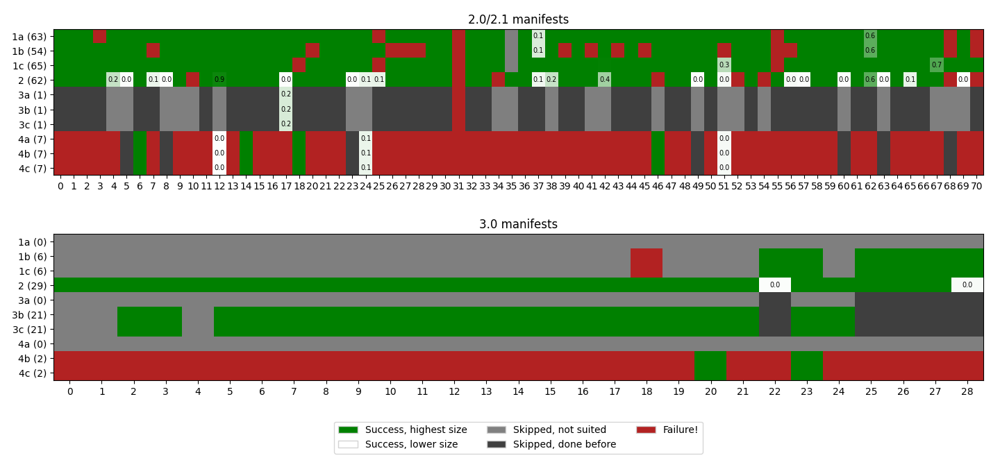

# Appendix

The images of the document can be obtained at different URIs, it depends on how the hosting website has been configured. Sometimes the same image can be obtained at different URIs, sometimes different qualities can be found at different paths, and sometimes some URIs simply return nothing.

Since different URIs must be tested, a priority scale has been defined. The working strategy is defined once at the beginning, while attempting to download the first page of the document with different URIs. We assume that all the document images behave in the same way so that, if it worked for the first page, it will work for all, without the need of trying different strategies for all the pages. If the download is not successful at level N, level N+1 is attempted, if it is successful at level N, levels > N are not attempted and level N is defined as the strategy to use for all the pages of the document.

Ten levels have been defined and they can be grouped in 4 categories. In the following list a "formatted URI" is defined as a URI formatted as the template given in the IIIF standards, with rotation = 0 and quality = 'default'.
- 1a. Formatted URI, base = service ID, size = 'full'
- 1b. Formatted URI, base = service ID, size = 'max'
- 1c. Formatted URI, base = service ID, size = width,
- 2\. URI defined in image ID
- 3a. Formatted URI, base = base(image ID), size = 'full'
- 3b. Formatted URI, base = base(image ID), size = 'max'
- 3c. Formatted URI, base = base(image ID), size = width,
- 4a. Formatted URI, base = image ID, size = 'full'
- 4b. Formatted URI, base = image ID, size = 'max'
- 4c. Formatted URI, base = image ID, size = width,

Strategies 1a, 1b, and 1c are not attempted if a service ID is not defined in the manifest. It is unlikely, but it may happen since the standards don't define it as mandatory. Strategy 2 is the only one that is valid for all manifests. The image to download is searched at the URI defined in the image ID field, it may be formatted as the template or not. Strategies 3a, 3b, and 3c are attempted only if the image ID is formatted as the URI template, so that a base can be extracted and three new URIs can be created. If the base of the image ID is equal to the service ID these strategies are not attempted, since we would repeat the same (unsuccessful) procedures of the first three levels. For the same reason strategies 4a, 4b, and 4c are attempted only if the service ID and the image ID are different.

The order of the strategies has been set in order to obtain the highest available quality, arguably in the fastest possible time. It is the result of a statistical analysis carried out on the manifests of the Testing directory. An URI with size = 'full' should return the highest resolution, however the direct access to that resource may be denied. An URI with size = 'max' should return the image at the maximum available size. size = 'full' is not compliant with the 3.0 API, while size = 'max' is not compliant with the 2.0 API (but it is with the 2.1 API). An URI with size = width, (please note the comma) is attempted when the other two fail, it should return the image at the width defined in the manifest (the height is calculated to maintain the aspect ratio of the image). The defined width may be smaller than in the original file, but sometimes this is the only way to obtain an image. If in the manifest a width that is higher than in original file has been defined, choosing this URI we end up downloading an unnecessarely enlarged file, but this eventuality is very unlikely and in our analysis it happened for manifests for which size = full already returned the image.

In the plots all the compliant URIs have been downloaded, however in reality we stop at the first successful one. Manifest 19 of the 2.0/2.1 plot has been removed from the analysis because the whole site was not available at the time of the experiments. Gray cells represent URIs that were not attempted, because the manifest definition of the page was not compliant with that URI (light gray) or because we would have repeated something made before (dark gray). Green cells represent cases that have been attempted and the downloads have been successful. The darkest green represent the image at the highest available size, while the lighter greens represent smaller images (the colors are scaled proportionally between white and the darkest green). For the 37th and the 62nd manifests of the 2.0/2.1 plot, the third attempt returned an image that was bigger than the previous two: these are enlarged files, with no added quality, and it would be correct to miss them downloading just the size = 'full' image. Red cells represent cases that are suitable for download but did not return an image, either because the access to the resource was denied or because there was no resource at all. As it can be seen from the plot, the correct strategy is found immediately for most of the manifests, sometimes two attempts are needed, one time 3 and one time 4. For the 31st manifest of the 2.0/2.1 set it has not been possibile to download the images, even trying 10 different strategies.
