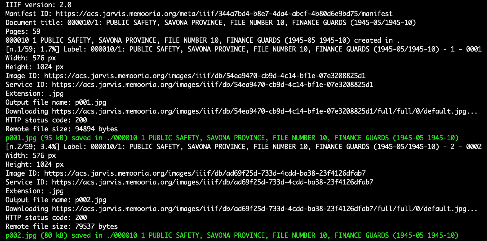
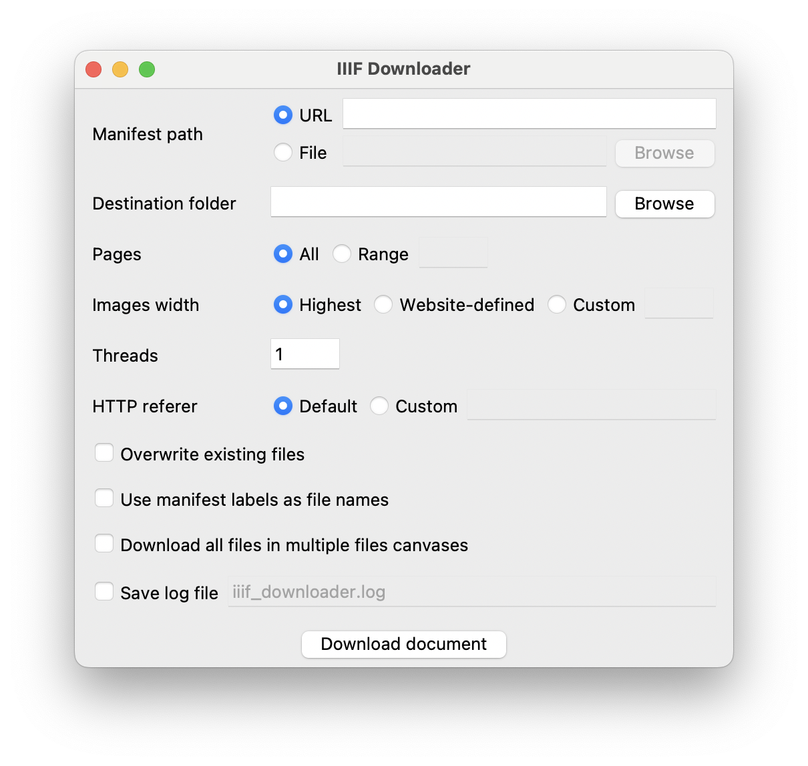

<p align="center">
  
</p>

<h1 align="center">IIIF Downloader</h1>

[](https://www.python.org/) [](https://opensource.org/license/MIT) [](https://github.com/ClaudioMartino/IIIF-Downloader/actions)

A single-file Python script and importable module for downloading all the images of a document described by the [International Image Interoperability Framework](https://iiif.io/) (IIIF) standard. This script requires only the Python Standard Library and supports IIIF APIs 2.0, 2.1, and 3.0.

## Basic usage

Run the script with:

```
python3 iiif_downloader.py -m <manifest>
```

All the images of the document at the highest available size will be downloaded on your computer, named with a progressive number (`p001.jpg` et cetera). The manifest can be a local file or an HTTP(S) URL. You can also use a collection of manifests: the script will download all the files from each manifest in different directories. See [this analysis](./docs/Discovery.md) for more information about the discovery of the image sources.



## Other options

* Specify the output directory with `-d <directory>`. The default value is the working directory (`.`).
* Specify the range of the pages you want to download with `-p <first>-<last>` (e.g. `-p 10-20` for pages from 10 to 20, or `-p 10-10` for page 10 only).
* Use the `-f` option to force the overwriting of the files when they are already present in the output directory.
* If you wish to download the images with a specific width use `-w <width>`. If you want to use the width defined by the website[^1] use simply `-w`, without the argument. Images defined this way may not be available for download, depending on the website configurations.
* Specify the [referer](https://en.wikipedia.org/wiki/HTTP_referer) of the HTTP requests header with `-r <referer>`. The default value is the hostname of the URL being opened.
* Use `-t <threads>` to set the number of threads used to download the pages of the document (one thread per page). The log may become unclear and you may encounter more 429 errors (Too Many Requests). See [this analysis](./docs/Threading.md) for more information about the effects of threading.
* With `-j <file>` you can save a .json file containing the metadata of the document.
* Use the `--use-labels` option to name the files with the manifest labels, instead of a progressive number. Use this option only if all the labels are different, otherwise all the files after the first won't be downloaded (or they will be overwritten if `-f` is set).
* When 2.0/2.1 canvases contain multiple images, you can use the `--all-images` option to download them all, otherwise only the first image of the canvas will be downloaded. The files will be identified by their position in the canvas (e.g. `p001_01.jpg`).
* Use the `-v` option to turn on verbose output.
* Use the `-q` option to activate the quiet mode and print only the error messages.

All these options can be displayed by running the helper with `-h`.

## Graphical user interface

<p align="center">
  
</p>

A graphical user interface (GUI) has been implemented with [TkInter](https://docs.python.org/3/library/tkinter.html). You can run it with:

```
python3 iiif_downloader_gui.py
```

## Advanced usage

You can import the module in your projects and run more complicated tasks. For instance:

```python
import iiif_downloader

downloader = iiif_downloader.IIIF_Downloader()
downloader.json_file = "https://iiif.io/api/cookbook/recipe/0001-mvm-image/manifest.json"
downloader.run()
```

Have a look at the [examples](examples) directory for some scripts making use of the module.

## Testing

Unit tests have been implemented in the [testing](testing) directory. Real world manifests have been used to test the parsing functions.

## Contributing

Contributions are most welcome by forking the repository and sending a pull request. Errors and new features proposals can be reported [opening an issue](https://github.com/ClaudioMartino/IIIF-Downloader/issues/new/choose) as well.

Before committing, please run all the tests. Run [Flake8](https://flake8.pycqa.org/), [Pylint](https://www.pylint.org/) (with `--enable=all --disable=C,R,W0718,W0719`) and [Mypy](https://mypy-lang.org/) (with `--strict`) to check the style and the typing of the scripts. The provided [pre-commit](tools/pre-commit) git hook runs everything automatically.

## License

All code and content is licensed under the [MIT License](LICENSE).

[^1]: The host can define two widths for each image: one in the manifest and one in the [Image Information](https://iiif.io/api/image/2.0/#image-information-request-uri-syntax) file. The script takes the biggest of the two.
