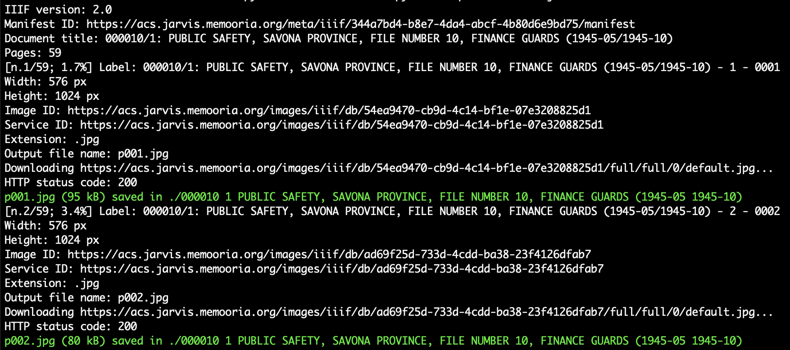
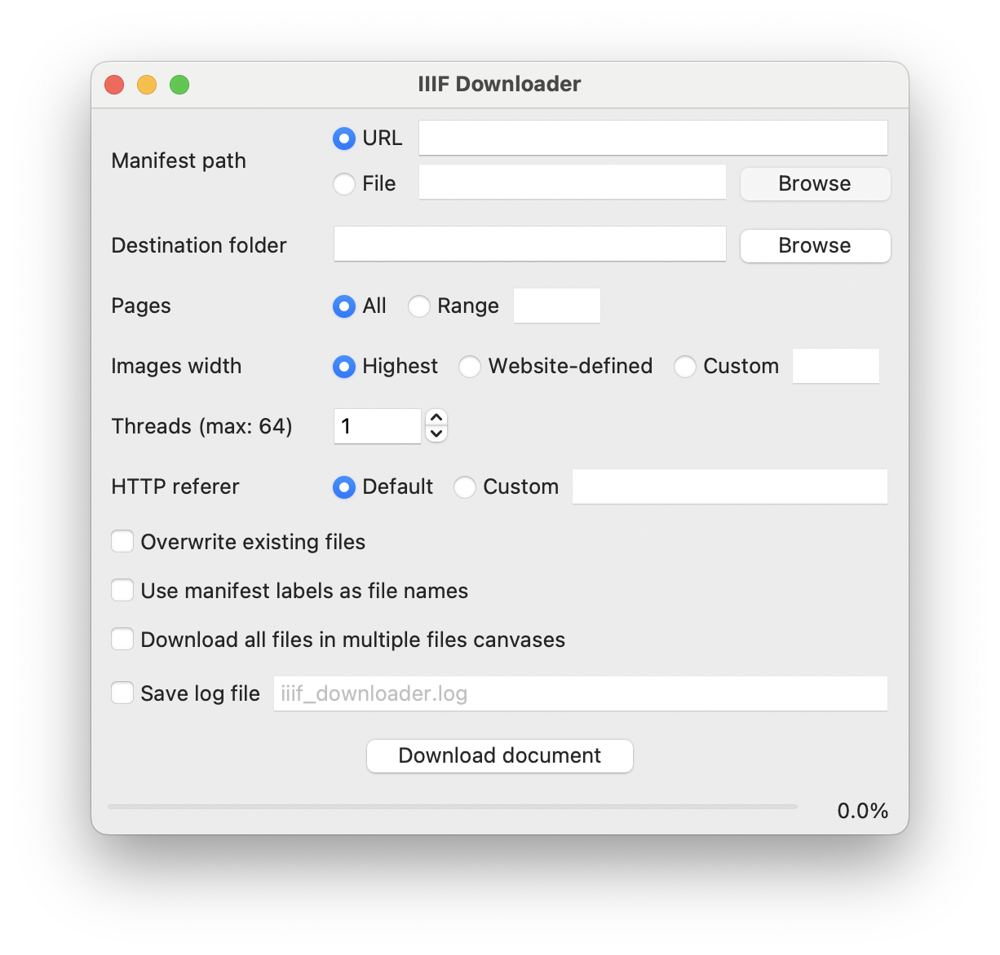

# IIIF Downloader

A Python 3 script to download all the images from an IIIF manifest.

IIIF is the [International Image Interoperability Framework](https://iiif.io/), a set of open standards for digital objects online. Most of the Python scripts out there ask you to install plenty of heavy external libraries. This script needs only standard libraries! It is compliant with the [2.0](https://iiif.io/api/presentation/2.0), the [2.1](https://iiif.io/api/presentation/2.1), and the [3.0](https://iiif.io/api/presentation/3.0) standards.

[](https://www.python.org/) [](https://opensource.org/license/MIT) [](https://github.com/ClaudioMartino/IIIF-Downloader/actions)
## Basic usage

Run the script as:

```
python3 iiif_downloader.py -m <manifest>
```

All the images of the document at the highest available size[^1] will be downloaded on your computer, named with a progressive number (`p001.jpg` et cetera).

The manifest can be a file on your computer or a http(s) link. You can also use a collection of manifests: the script will recognize it and download all the files from the manifests in different directories.



## Other options

* You can specify the output directory with `-d <directory>`. The default value is the working directory (`.`).
* You can specify the range of the pages you want to download with `-p <first>-<last>` (e.g. `-p 10-20` for pages from 10 to 20, or `-p 10-10` for page 10 only).
* You can use the `-f` option to force the overwriting of the files when they are already present in your working directory.
* If you wish to download the images with a specific width use `-w <width>`. If you want to use the width defined by the website[^2] use simply `-w`, without the argument. Images defined this way may not be available for download, depending on the website configurations.
* You can specify the [referer of the HTTP requests header](https://en.wikipedia.org/wiki/HTTP_referer) with `-r <referer>`. The default value is the hostname of the url you are opening.
* Use `-t <threads>` to set the number of threads used to download the pages of the document (one thread per page). Log may become unclear and you may encounter more 429 errors (Too Many Requests).[^3]
* With `-j <file>` you can save a .json file containing the metadata of the document.
* You can use the `--use-labels` option to name the files with the manifest labels, instead of a progressive number. Use this option only if all the labels are different, otherwise the files are going to be overwritten or not downloaded.
* When 2.0/2.1 canvases contain multiple images, you can use the `--all-images` option to download them all, otherwise only the first image is downloaded. The files will be identified by their position in the canvas (e.g. `p001_01.jpg`).
* Use the `-v` option to print a verbose output.
* Use the `-q` option to activate the quiet mode and print only the error messages.

All these options can be displayed by running the helper with `-h`.

## Advanced usage

You can include the library in your project and run more complicated tasks. You can also set what level of log messages you want to record. Have a look at the [examples](examples) directory.

## Graphical user interface

<p align="center">
  
</p>

A graphical user interface (GUI) has been implemented with [TkInter](https://wiki.python.org/moin/TkInter). You can run it as:

```
python3 iiif_downloader_gui.py
```

## Testing

The library has been tested with the manifests listed in the [testing](testing) directory.

## Contributing

Contributions are most welcome by forking the repository and sending a pull request. Errors and new features proposals can be reported [opening an issue](https://github.com/ClaudioMartino/IIIF-Downloader/issues/new/choose) as well.

[^1]: See the [Appendix](https://github.com/ClaudioMartino/IIIF-Downloader/blob/main/docs/Appendix.md) for more information about the discovery of the image sources.
[^2]: The host can define two widths for each image: one in the manifest and one in the [Image Information](https://iiif.io/api/image/2.0/#image-information-request-uri-syntax) file. The script takes the biggest of the two.
[^3]: See [the analysis](https://github.com/ClaudioMartino/IIIF-Downloader/blob/main/docs/Threading.md) for more information about the effects of threading.
