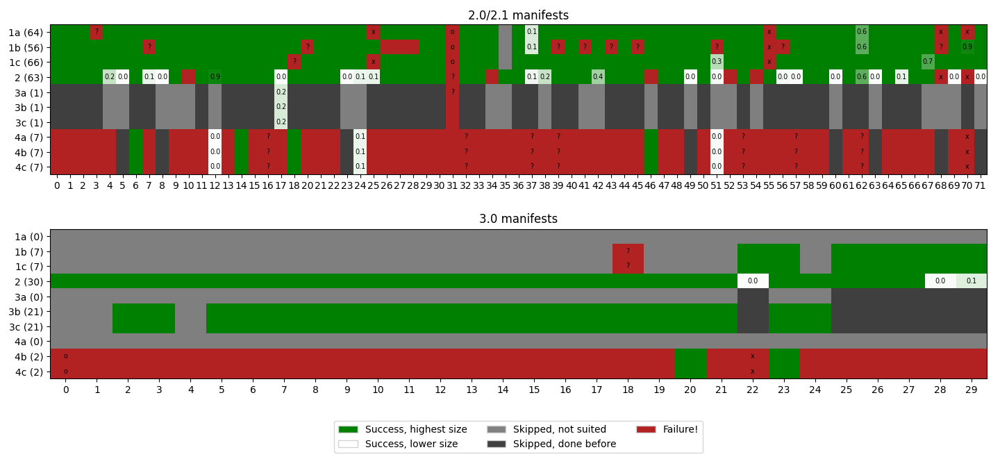

# Image discovery

The images of the document can be obtained at different URIs, it depends on how the hosting website has been configured. Sometimes the same image can be obtained at different URIs, sometimes different qualities can be found at different paths, and sometimes some URIs simply return nothing.

Since different URIs must be tested, a priority scale has been defined. The working strategy is defined once at the beginning, while attempting to download the first page with different URIs. We assume that all the document images behave in the same way so that, if it worked for the first page, it will work for all, without the need of trying different strategies for all the pages. If the download is not successful at level N, level N+1 is attempted, if it is successful at level N, levels > N are not attempted and level N is defined as the strategy to use for all the pages of the document.

Ten levels have been defined and they can be grouped in 4 categories. In the following list a "formatted URI" is defined as a URI formatted as the template given in the IIIF standards[^1] with rotation = `0` and quality = `default`.
- 1a. Formatted URI, base = service ID, size = `full`
- 1b. Formatted URI, base = service ID, size = `max`
- 1c. Formatted URI, base = service ID, size = `<width>,`
- 2\. URI defined in image ID
- 3a. Formatted URI, base = base(image ID), size = `full`
- 3b. Formatted URI, base = base(image ID), size = `max`
- 3c. Formatted URI, base = base(image ID), size = `<width>,`
- 4a. Formatted URI, base = image ID, size = `full`
- 4b. Formatted URI, base = image ID, size = `max`
- 4c. Formatted URI, base = image ID, size = `<width>,`

Strategies 1a, 1b, and 1c are not attempted if a service ID is not defined in the manifest. It is unlikely, but it may happen since the standards don't define it as mandatory. Strategy 2 is the only one that is valid for all manifests. The image to download is searched at the URI defined in the image ID field, it may be formatted as the template or not. Strategies 3a, 3b, and 3c are attempted only if the image ID is formatted as the URI template, so that a base can be extracted and three new URIs can be created. If the base of the image ID is equal to the service ID these strategies are not attempted, since we would repeat the same (unsuccessful) procedures of the first three levels. For the same reason strategies 4a, 4b, and 4c are attempted only if the service ID and the image ID are different.

The order of the strategies has been set in order to obtain the highest available quality, arguably in the fastest possible time. It is the result of a statistical analysis carried out on the manifests of the Testing directory. An URI with size = `full` should return the highest resolution, however the direct access to that resource may be denied. An URI with size = `max` should return the image at the maximum available size. size = `full` is not compliant with the 3.0 API, while size = `max` is not compliant with the 2.0 API (but it is with the 2.1 API). An URI with size = `<width>,` (please note the comma) is attempted when the other two fail, it should return the image at the width defined in the manifest (the height is calculated to maintain the aspect ratio of the image). The defined width may be smaller than in the original file, but sometimes this is the only way to obtain an image. If in the manifest a width that is higher than in original file has been defined, choosing this URI we end up downloading an unnecessarely enlarged file, but this eventuality is very unlikely and in our analysis it happened for manifests for which size = `full` already returned the image.

Please note that in the plots all the strategies are described, while in reality we stop at the first successful one, as explained before. Gray cells represent URIs that were not attempted, because the manifest definition of the page was not compliant with that URI (light gray) or because we would have repeated something made before (dark gray). Green cells represent cases that have been attempted and the downloads have been successful. The darkest green represents the image at the highest available size, while the lighter green represents smaller files (colors are scaled proportionally, size ratios have been written in the cells). Red cells represent cases that, even if they are suitable for download, did not return an image, either because of a 404 error (plain red), a 403 error (x), a 406 error (o) or something else (?, e.g. an HTML page with an error message).

Manifest 2.0/2.1, n. 19 was excluded from the analysis because the whole site was not available at the time of the experiments. As it can be seen from the plot, the correct strategy was identified on the first attempt for most of the manifests. In three cases, two attempts were required (2.0/2.1, manifests n. 3, n. 25 and n. 70), in two cases three attempts (2.0/2.1, n. 68 and 3.0, n. 18) and in one case four attempts (2.0/2.1, n. 55). It has not been possibile to download manifest n. 31 images because of the unusual server configuration.[^2] For manifests 2.0/2.1 n. 37, n. 62 and n. 70, strategies 1a or 1b returned images smaller than those obtained with strategy 1c. However, for n. 37 and n. 62, the 1c images were upscaled files with no added quality. For n. 70, the 1c images were actually better (altough the difference is very small): this is a special case where the Image Information width was used instead of the manifest width, we may think of changing the priority order in events like this.

[^1]: `https://[...]/<region>/<size>/<rotation>/<quality>.<format>`, see [Image API 3.0 - Image Request URI Syntax](https://iiif.io/api/image/3.0/#21-image-request-uri-syntax).
[^2]: That website is using a Cantaloupe image server to serve IIIF images and Amazon s3 buckets to serve pre generated thumbnails (see [here](https://github.com/cantaloupe-project/cantaloupe/discussions/509) and [here](https://stackoverflow.com/questions/67605444/image-serving-from-two-different-servers)). The image IDs written in the manifest are in the form `https://[...]/iiif/3/baf__/<id>/full/max/0/default.jpg` instead of simply `https://[...]/iiif/3/<id>/full/max/0/default.jpg` as one would expect. In fact, the full resolution image can be found removing the `/` before the `<id>` (as it can be seen in the thumbnail fields). Most likely, a redirect is performed by the image server with internal rules.
