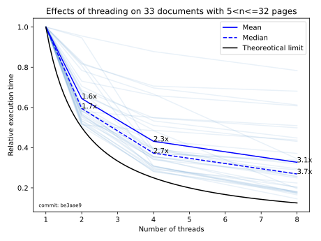

# Effects of threading

Threading support has been added to the downloader with commits [be3aae9](https://github.com/ClaudioMartino/IIIF-Downloader/commit/be3aae9a6a1c341995c7e4b5fc184092afe11067) and [c6a1119](https://github.com/ClaudioMartino/IIIF-Downloader/commit/c6a11192e5af7bf3a742ab4241260819a4c5cc25). The selected number of threads is used to download pages from the document in parallel.

On average, the execution time has been decreased proportionally to the number of threads, as it can be seen in the figure.

## Old performance
Before the usage of a [ThreadPoolExecutor](https://docs.python.org/3/library/concurrent.futures.html#threadpoolexecutor) the average execution time was scaling slightly worse.

