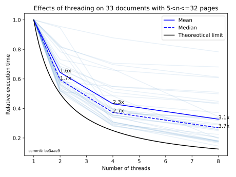

# Effects of threading

Threading support has been added to the downloader with commit [be3aae9](https://github.com/ClaudioMartino/IIIF-Downloader/commit/be3aae9a6a1c341995c7e4b5fc184092afe11067). The selected number of threads is used to download pages from the document in parallel.

On average, the execution time has been decreased proportionally to the number of threads, as it can be seen in the figure.

